#### IMPLEMENTING A CLIENT SERVER ARCHITECTURE USING MySQL DATABASE MANAGEMENT SYSTEM (DBMS)
>  Create and configure two linux-based virtual servers (ubuntu)

> On mysql server linux server install MySQL server software

    sudo apt install mysql-server
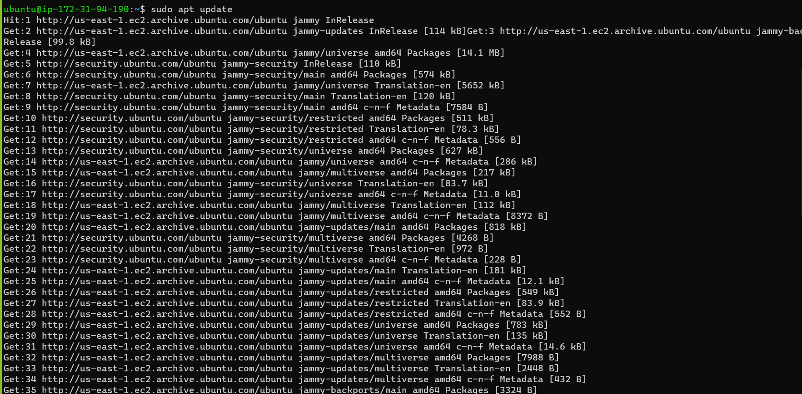
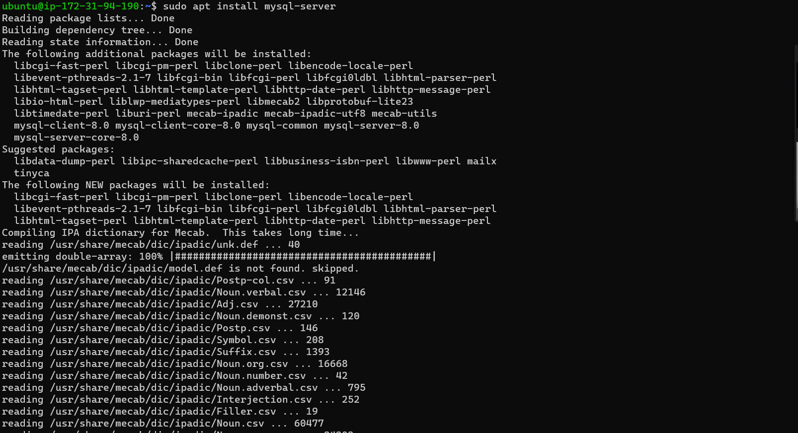

> After installing log into mysql

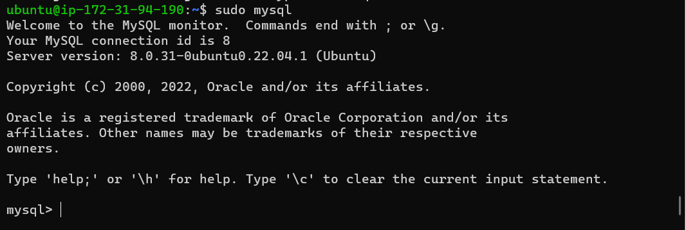

> Set password

    sudo mysql -p

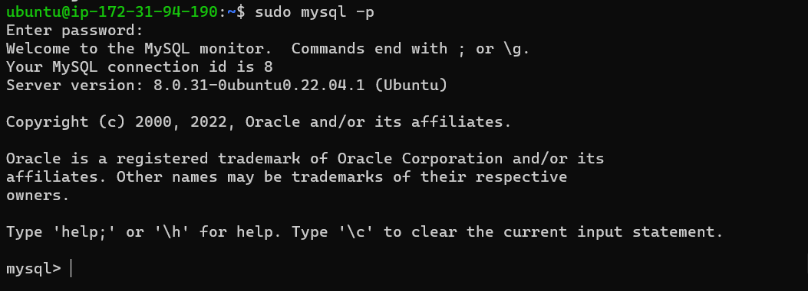

> Create a TCP port 3306 for mysql server virtual server

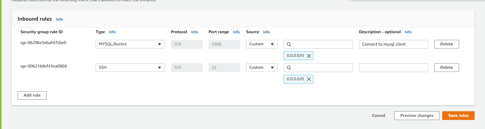

> On mysql client linux server install MySQL client software

    sudo apt install mysql-client-core-8.0

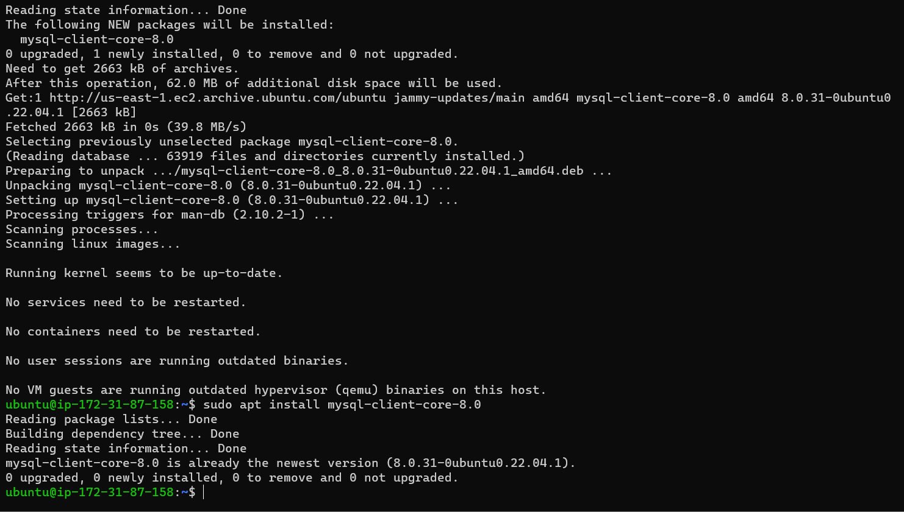

> IP access should only be given to the local IP address of mysql client virtual server
> Configure MySQL server to allow connections from remote hosts

    sudo vi /etc/mysql/mysql.conf.d/mysqld.cnf

> Change bind-address to 0.0.0.0

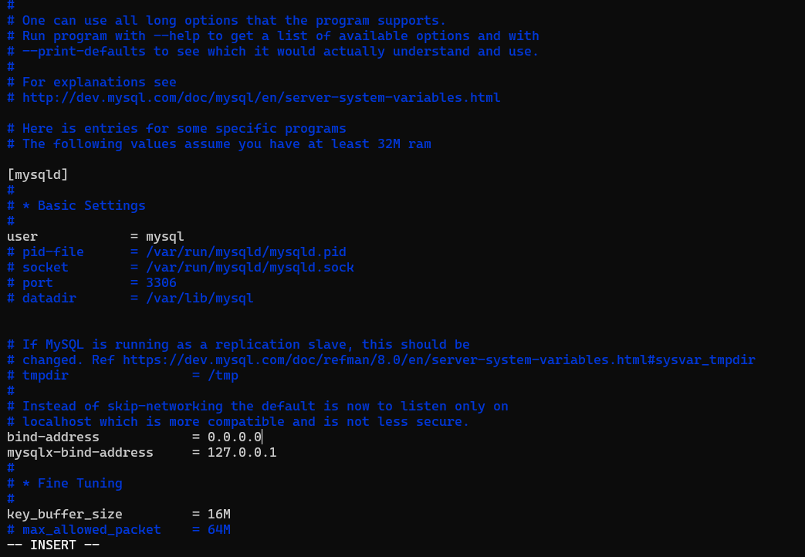
> Close and save the file, the log out of zoom

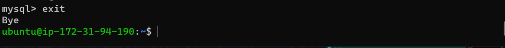

> Create a user with a home directory and give it password

     CREATE USER 'ifeoluwa'@'local-Ip-address' IDENTIFIED WITH mysql_native_password BY 'PassWord.1';

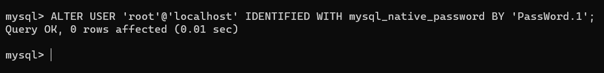

> Create a database and grant the user all permissions and access to the database

    GRANT ALL PRIVILEGES ON *.* TO 'ifeoluwa'@'local-ip-address' WITH GRANT OPTION;

    FLUSH PRIVILEGES;
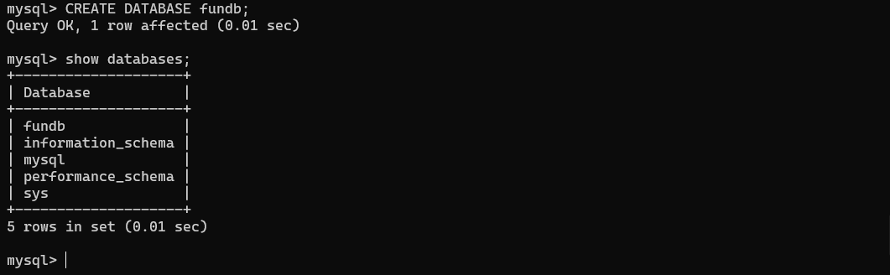

> Test the connection of the servers using private ip address of the server mysql along side the username and password on client server.

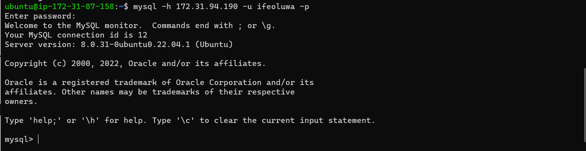
> Sucessfully connected Mysql server to Mysql client virtual servers

